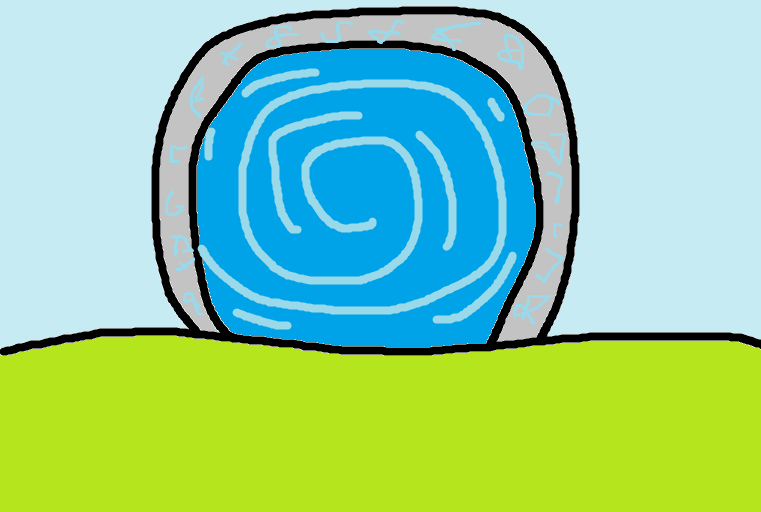
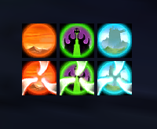
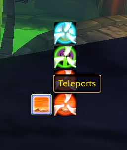

# Portals

A World of Warcraft addon for mages on WoW Forever. It puts your teleports and
portals on a bar of their own, or tucks them into two flyout buttons.

Only the spells you've learned are shown, so the bar grows as you train new
ones. The buttons work in combat, and a flyout closes again after you cast.

## Install

1. Download the Portals zip from the
   [latest release](https://github.com/frogwizard-dev/portals/releases/latest).
2. Unzip it into `World of Warcraft\_classic_beta_\Interface\AddOns\`, so that
   you have an `AddOns\Portals` folder containing `Portals.toc`. Windows'
   Extract All adds an extra folder named after the zip, so if you end up with
   `AddOns\Portals-1.0.1\Portals`, move the inner `Portals` folder up into
   `AddOns`.
3. Start the game (restart it if it was already running) and check that the
   addon is enabled on the character select screen (AddOns button).
4. Type `/portals edit` to see every button and drag the bar where you want it,
   then `/portals edit` again to finish.

## Commands

| Command | What it does |
|---|---|
| `/portals bar` | Show teleports and portals as two rows of buttons |
| `/portals flyout` | Group them into a Teleports button and a Portals button |
| `/portals edit` | Preview every teleport and portal for your faction, even ones you haven't learned, and move the bar |
| `/portals lock` / `/portals unlock` | When unlocked, drag the bar by the blue box |
| `/portals scale <0.3-3>` | Scale the whole bar |
| `/portals size <16-80>` | Button size in pixels |
| `/portals dir <up, down, left or right>` | Which way the flyouts open |
| `/portals test` | Show every spell at full colour, for screenshots |
| `/portals reset` | Put the bar back in its starting position |
